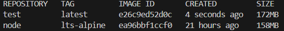

# Dockerization

Hey!

I have created both Dockerfile and .dockerignore files
In the .dockerignore file i decided to add all the .gitignore files and to add the .dockerignore and Dockerfile files.
After doing that i decided to EXCLUDE the node_modules file from the .dockerignore file so it will be easier and faster for developers to dockerize their applications if the would like to.
I do want to mention that i have changed the package.json dependencies because there were unused dependencies and also the typescript were in the dependencies and not the devDependencies which was costing alot of storage for the image.

Now for the Dockerfile. Was thinking about using bitnami node image but decided the regular one becuase it is not a complex application. chose lts-alpine tag for minimal storage. You also can use even smaller distroless images but i wanted also stability and support of official node and alpine images.
I have decided doing multistage dockerfile for storage and organization reasons
The first stage gets the necessary files from the relative context and installing both dependencies and devDependencies. i have decided doing npm install and not clean install for the reason mentioned above about the developer experience.
Right after this i ran the npm run build command which executes the build script in the package.json file which actually creates a dist folder and converting the typescript files into final javascript files.

I do wanna mention that there are alot of good ways for defining a dockerfile, using or not a .dockerignore, multistage or one stage, installing the dependencies once and moving them to the next stage or installing them twice. I have decided using both .dockerignore, multistage and installing the deps twice because i wanted to maintain storage reasons of excluding the unwanted typescript files and also when you assign the --production flag you can minimize the needed dependencies too if they have a feature for that.

Now we can move into the second stage. same image.
Now copying the new files javascript files and the packages files.
This time clean installing for making sure there is no cache and the validity of the package files.
Also using --production flags to exclude the devDependencies from installing and minimizing the dependencies size as we can.

Now moving into variables.
Added empty BUCKET_NAME environment variable in order to add it to the metadata of the image for best practice and usage helping purposes
Now moving into the PORT variable. I decided using both ARG and ENV keywords. ARG for prechanging the EXPOSE keyword and exposedPorts metadata section if needed and ENV the same reason as BUCKET_NAME. Used port 3000 as default.

As we can see when using `docker build -t test .` and `docker inspect test` the metadata looks like this.

And now we'll build the image with a build arg `docker build -t test --build-arg=PORT=1234 .` the metadata looks like that.

For entrypoint I just ran the new javascript main file.

As you can see there is only 14MB diff of dependencies and code instead of 150MB+ if done uncorrectly

