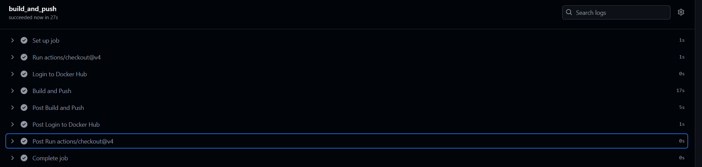

# Continuous Integration (CI)

I have chose using GitHub Actions although my experience is from gitlab CI and Jenkins.
First i mentioned a setting which the pipeline only triggered when there is a push to the master branch.
The docker registry i chose is my own dockerhub docker registry.

Then i created a job which does the following steps while using external predefined github jobs:
1. checks out to my relevant context which from my understanding is a must to preserve my .dockerignore settings
2. Logging in to my dockerhub user and using a precreated token for it.
3. Building and Pushing the image

I am mentioning that i have seen that there is no requirement for version control so i chose not doing it and pushing to latest tag for now.

